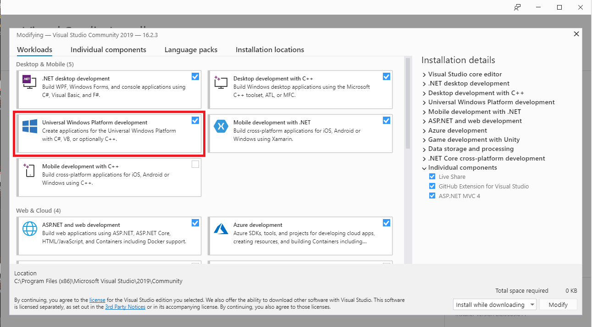
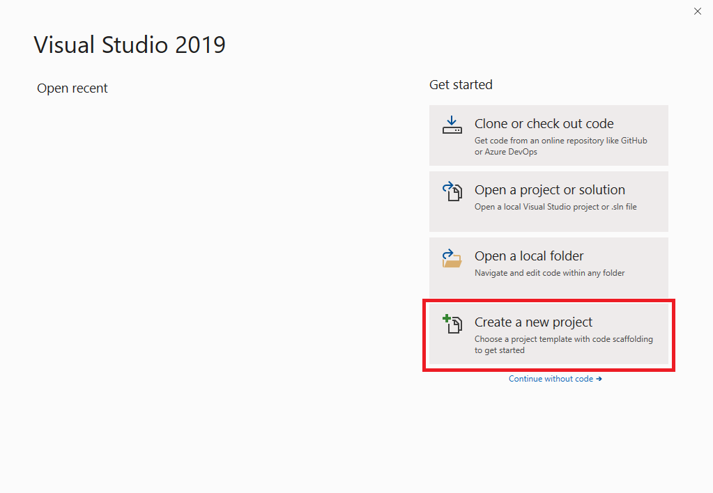
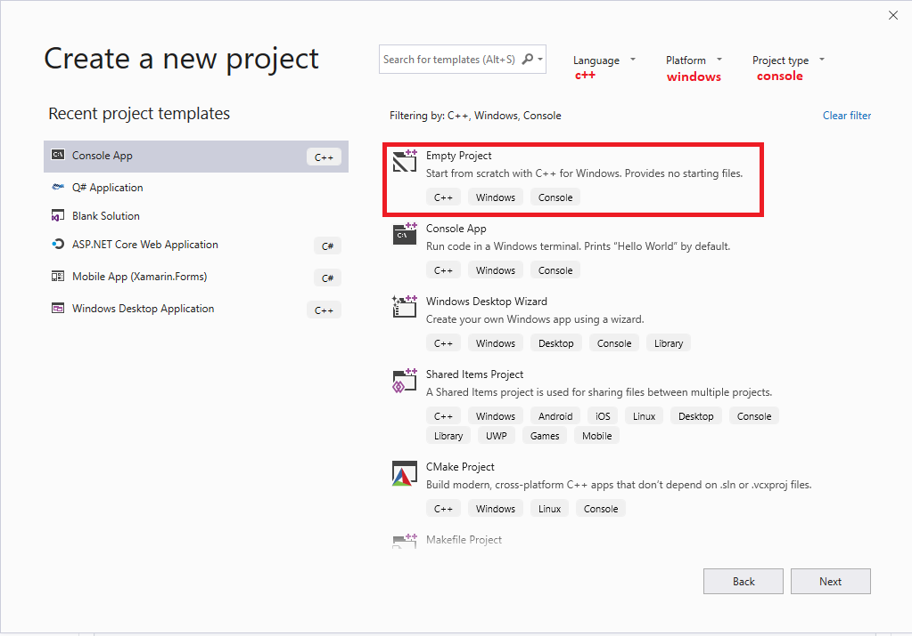
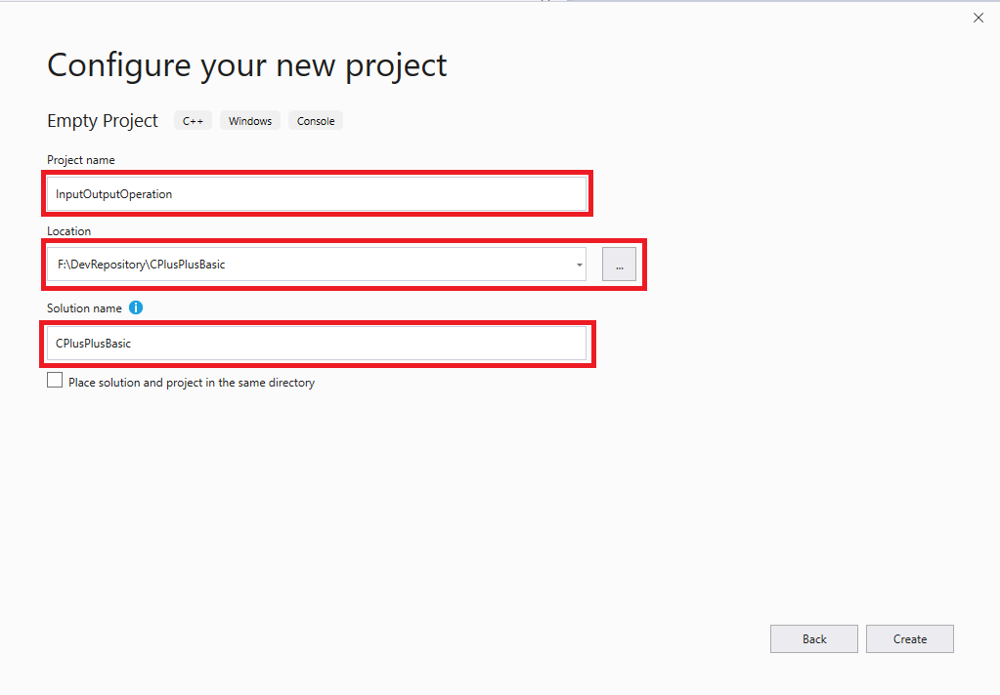

 [назад](/../..)
 
 # ПЪРВИ СТЪПКИ С VISUAL STUDIO

Microsoft Visual Studio е мощна интегрирана среда за разработка (integrated development environment, IDE) на софтуерни приложения. Използва се за разработка на конзолни и графични потребителски интерфейс приложения, уеб сайтове, уеб приложения и уеб услуги.

Visual Studio предоставя мощна интегрирана среда за писане на код, компилиране, изпълнение, дебъгване, тестване на приложения, дизайн на потребителски интерфейс, моделиране на данни, моделиране на класове, изпълнение на тестове, пакетиране на приложения и стотици други функции.

Visual Studio поддържа различни езици за програмиране и различни технологии за разработка на софтуер. Ние ще използваме езика Visual C++ и технологията за разработване на софтуер Win32 Console Application. 

## Инсталираne на Microsoft Visual Studio Community 2019

Изтеглете средата [Visual Studio Community](https://visualstudio.microsoft.com/vs/community/) това е свободна среда за разработване на приложения.

Може да инсталирате компоненти по избор за текущия курс ще ви е необходим Universal Windows Platform development. По време на инсталирането следвайте стъпките за инсталация.

## Създаване на конзолна програма

### Създаване на нов проект

### Избиране на език, платформа и тип на проекта

### Именуване на проект

Името на проекта трябва да подсказва каква е целта на проекта на латиница.
Пример: Проект за аритметични операции ще се казва АrithmeticОperations.

Директорията на проекта трябва да е уникална и да съхранява всички проекти.

Solution е хранилище за проекти в него могат да бъдат създдени повече от един проект.

 [назад](/../..)
